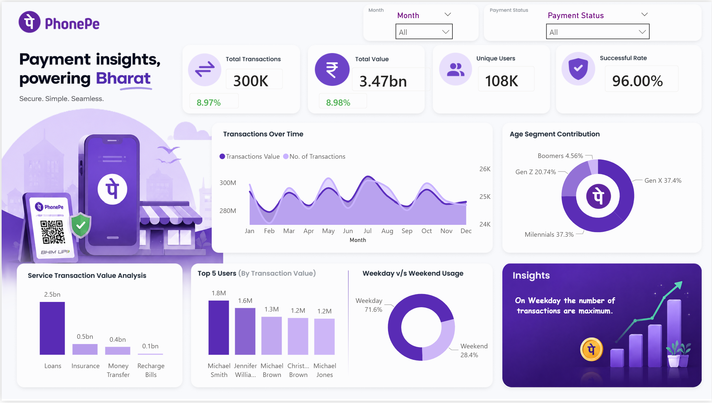
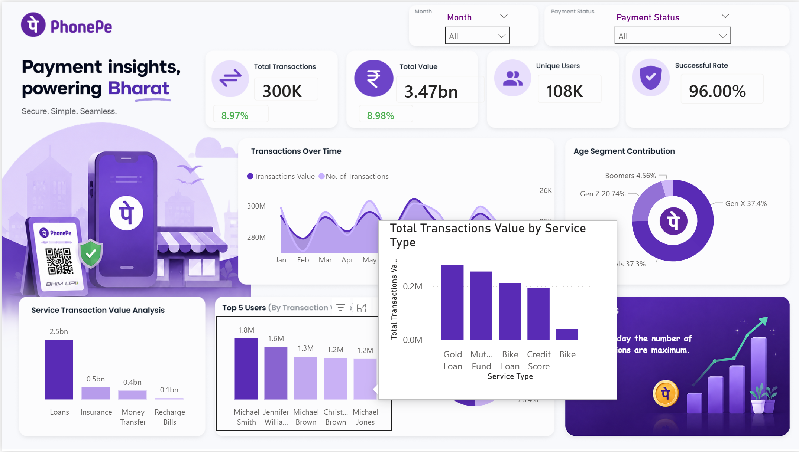

# 📱 PhonePe Payment Analytics Dashboard

## 📌 Project Overview

The PhonePe Payment Analytics Dashboard is an interactive Power BI project designed to analyze digital payment transactions, user behavior, transaction values, and service utilization patterns.

The dashboard provides actionable insights into transaction trends, customer segments, payment success rates, and usage behavior through dynamic visualizations and interactive filters.

---

## 🎯 Objectives

- Analyze transaction volume and transaction value trends.
- Monitor payment success rates.
- Understand user demographics and age segment contribution.
- Identify top users based on transaction value.
- Compare weekday and weekend usage patterns.
- Evaluate service-wise transaction performance.

---

## 🛠️ Tools & Technologies

- Power BI Desktop
- Power Query
- DAX (Data Analysis Expressions)
- Data Visualization
- Microsoft Excel / CSV Dataset

---

## 📊 Dashboard Features

### KPI Cards

- Total Transactions
- Total Transaction Value
- Unique Users
- Payment Success Rate

### Interactive Filters

- Month Filter
- Payment Status Filter

### Visualizations

- Transactions Over Time
- Age Segment Contribution
- Service Transaction Value Analysis
- Top 5 Users by Transaction Value
- Weekday vs Weekend Usage Analysis

### Advanced Features

- Conditional KPI Coloring
- Interactive Filters
- Custom Tooltip Pages
- Dynamic Insights Section

---

## 🔍 Key Insights

### Transaction Performance

- Total transaction value exceeded ₹3.47 Billion.
- Payment success rate remained above 96%.

### User Analysis

- Gen X and Millennials contribute the majority of transaction volume.
- Top users generate significantly higher transaction values.

### Usage Patterns

- Weekday transactions are substantially higher than weekend transactions.
- Peak transaction activity occurs during specific months.

### Service Analysis

- Loan-related transactions contribute the highest transaction value.
- Recharge and utility bill payments contribute comparatively less.

---

## 📸 Dashboard Preview

  

  

---

## 📂 Project Structure

PhonePe-Payment-Analytics-Dashboard/

├── Dashboard/

│ └── PhonePe_Analytics.pbix

├── Dataset/

│ └── phonepe_transactions.xlsx

├── Screenshots/

│ └── dashboard-overview.png

├── Assets/

│ └── Images used in background and logo

└── README.md

---

## 📈 Skills Demonstrated

- Data Cleaning & Transformation
- Power Query
- DAX Measures
- KPI Analysis
- Conditional Formatting
- Custom Tooltips
- Interactive Dashboard Design
- Business Intelligence Reporting
- Data Storytelling

---

## 🚀 How to Use

1. Download the repository.
2. Open the PBIX file using Power BI Desktop.
3. Refresh the dataset if required.
4. Explore dashboard insights using filters and interactive visuals.

---

## 👨‍💻 Author

Atharva Bagade

---

## ⭐ Project Highlights

- Interactive Power BI Dashboard
- PhonePe-Themed UI Design
- KPI Monitoring & Trend Analysis
- User Segmentation Analysis
- Custom Tooltip Implementation
- Conditional KPI Formatting
- Portfolio-Ready Business Intelligence Project
